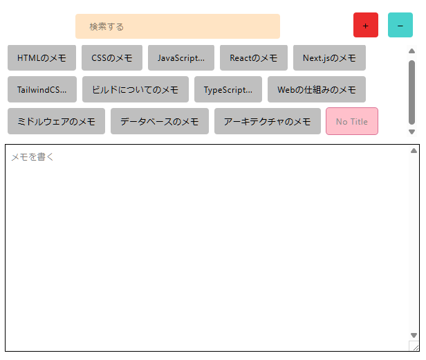

## Memo App Extension

Chrome 拡張として動作する、ローカル専用の軽量メモアプリです。追加・削除・検索が直感的にでき、入力内容の先頭から自動でタイトルを生成します。データは `chrome.storage.local` に保存され、ネットワーク送信は一切行いません。

### なぜ作ったか（採用向けハイライト）

- **体験最優先の小さなプロダクト**: 迷いなく「書ける・探せる」を実現する最小 UI を設計。
- **MV3 ベースの堅実な実装**: `chrome.storage.local` 永続化、状態は React Context で疎結合管理。
- **読みやすい TypeScript**: 役割ごとに関数を分割し、例外処理・ガード節・命名規約を徹底。

---

## 機能

- **メモ追加/削除**: ＋/－ ボタンで即時操作、フォーカスは自動でテキストエリアへ移動
- **自動タイトル生成**: 本文の先頭 10 文字＋省略記号（`...`）をタイトルに反映
- **全文検索**: 本文に対するインクリメンタルフィルタ（部分一致）
- **現在選択の保持**: 再起動後も前回のメモを復元（`currentMemoId` を保存）
- **ローカル永続化**: すべて `chrome.storage.local` に保存。外部送信なし

## スクリーンショット



## 技術スタック

- React 19 + TypeScript
- Vite 7
- Tailwind CSS 4
- Chrome Extension Manifest V3（permission: `storage`）

## ディレクトリ構成（抜粋）

```
src/
  components/
    AddButton.tsx        // 追加操作とフォーカス制御
    DeleteButton.tsx     // 現在メモの削除と選択状態の更新
    InputSearch.tsx      // 本文インクリメンタル検索
    Memos.tsx            // メモ一覧と選択ハイライト
    TextArea.tsx         // 本文編集・保存（タイトル自動生成）
  utils/
    functions.ts         // storage入出力・初期化・ユーティリティ
    contexts.ts          // React Context 定義
    types.ts             // 型定義
public/manifest.json     // MV3 マニフェスト（popup: index.html）
```

## 主要な実装ポイント

- **永続化レイヤ**: `saveMemos`/`loadMemos` と `saveCurrentMemoId`/`loadCurrentMemoId`
- **初期化**: アプリ起動時にメモ一覧・カレント ID を読み込み（存在すれば状態へ反映）
- **自動タイトル**: `generateTitle(content, 10)` で本文からタイトル生成
- **検索**: `InputSearch` で `memos` をフィルタし `FilteredMemosContext` に供給
- **UX 配慮**: メモ選択・追加時は textarea にフォーカス、選択切替時は先頭へスクロール

## ローカルで動かす

前提: Node.js（LTS 推奨）/ npm

```bash
npm ci        # 初回は npm install でも可
npm run build # dist/ を生成
```

Chrome で以下を実施:

1. `chrome://extensions/` を開く
2. 右上の「デベロッパーモード」を有効化
3. 「パッケージ化されていない拡張機能を読み込む」→ プロジェクトの `dist/` を選択
4. ツールバーの拡張機能アイコンから本拡張をピン留めし、起動

開発時にブラウザで UI だけ確認したい場合:

```bash
npm run dev   # Vite のプレビュー（拡張ポップアップではなく単体のWebページ）
```

※ 拡張ポップアップとしての挙動を確認・配布する際は `npm run build` を使用してください。

## コマンド

- **開発**: `npm run dev`
- **ビルド**: `npm run build`
- **プレビュー**: `npm run preview`
- **Lint**: `npm run lint`

## 設計/品質ポリシー

- 明確な命名とガード節で早期リターン、深いネストを回避
- 例外は捕捉し、ユーザ影響の低いログ出力に限定
- UI は Tailwind のカスタム CSS 変数を活用して一貫性を維持
- 状態は Context に閉じ、コンポーネント間の結合度を低減

## セキュリティ/プライバシー

- すべてのデータはローカルの `chrome.storage.local` のみに保存
- ネットワーク送信は行いません（オフラインで完結）

## 今後の拡張アイデア

- タグ/フォルダによる分類
- エクスポート/インポート（JSON）
- ショートカット操作（新規作成、検索フォーカスなど）
- 端末間同期（任意、ユーザ選択で有効化）

## ライセンス

MIT

---

採用に関するお問い合わせや補足のご要望があれば、お気軽にお知らせください。
